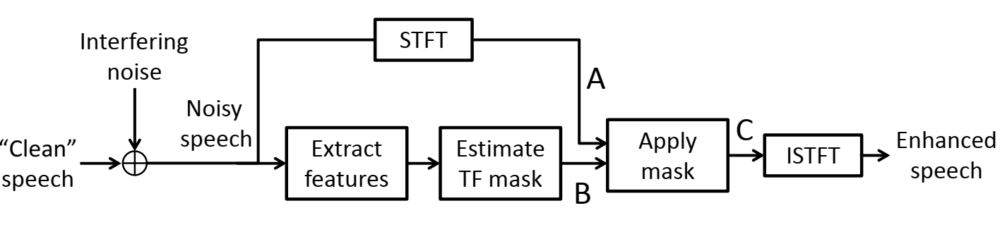

## Latest projects

My current work focuses on improving the intelligibility of noisy speech signals using algorithms based on feed-forward and recurrent neural networks. This research has several possible applications including hearing aids, forensics, and voice communications in adverse environments. In a recent project, working with colleagues in the [Speech and Audio Processing Laboratory](https://www.commsp.ee.ic.ac.uk/~sap/), we integrated one of these algorithms into a [proposed multiple-microphone hearing aid system](https://ieeexplore.ieee.org/document/8521361), leading to substantial improvements in predicted intelligibility in very noisy conditions.

The algorithms have the structure shown below. 




## Welcome to GitHub Pages

You can use the [editor on GitHub](https://github.com/leolightburn/leolightburn.github.io/edit/master/index.md) to maintain and preview the content for your website in Markdown files.

Whenever you commit to this repository, GitHub Pages will run [Jekyll](https://jekyllrb.com/) to rebuild the pages in your site, from the content in your Markdown files.

### Markdown

Markdown is a lightweight and easy-to-use syntax for styling your writing. It includes conventions for

```markdown
Syntax highlighted code block

# Header 1
## Header 2
### Header 3

- Bulleted
- List

1. Numbered
2. List

**Bold** and _Italic_ and `Code` text

[Link](url) and 
```

For more details see [GitHub Flavored Markdown](https://guides.github.com/features/mastering-markdown/).

### Jekyll Themes

Your Pages site will use the layout and styles from the Jekyll theme you have selected in your [repository settings](https://github.com/leolightburn/leolightburn.github.io/settings). The name of this theme is saved in the Jekyll `_config.yml` configuration file.

### Support or Contact

Having trouble with Pages? Check out our [documentation](https://help.github.com/categories/github-pages-basics/) or [contact support](https://github.com/contact) and we’ll help you sort it out.
